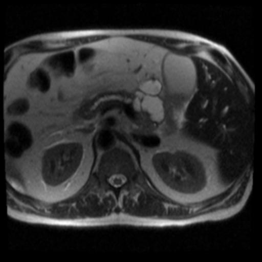
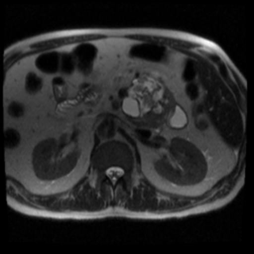
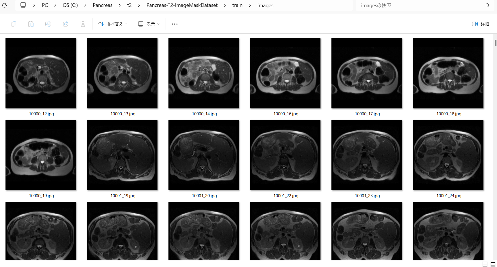
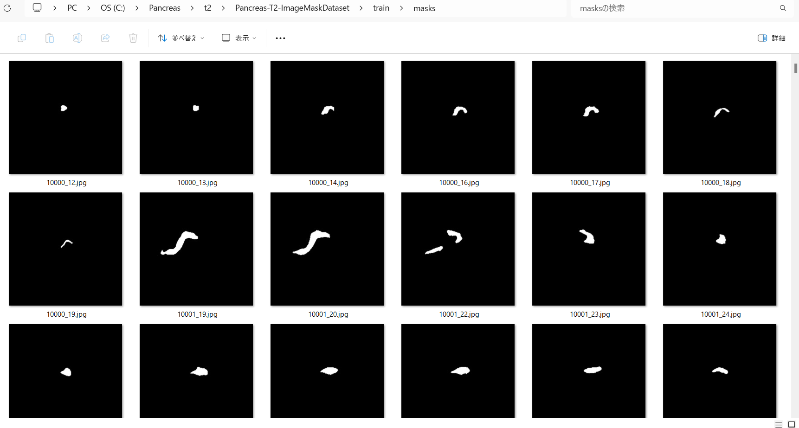
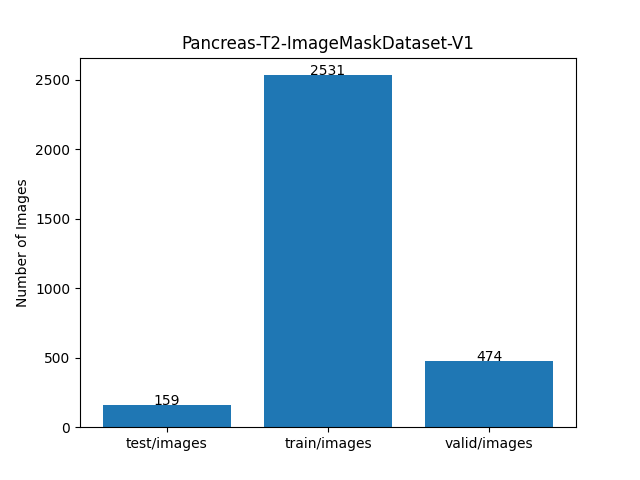

<h2>ImageMask-Dataset-Pancreas-T2 (2024/07/10) </h2>
This is a simple 512x512 JPEG ImageMask Dataset for Pancreas Image Segmentation. 
The original Pancreas Data used here has been taken from OSF HOME 
<a href="https://osf.io/kysnj/">
<b>PanSegData</b></a>
 
  
<b>Download </b> 
You can download our 512x512 ImageMask Dataset generated here 
 from the google drive 
<a href="https://drive.google.com/file/d/12gCJLIhqOG52-VpOWxYG14r54KR66CiT/view?usp=sharing">Pancreas-T2-ImageMaskDataset-V1.zip</a>, which is a subset of T2W (t2.zip) 
in the original Pancreas_MRI_Dataset of OSF Storage <a href="https://osf.io/kysnj/">
<b>PanSegData.</b></a> 
 
<b>Samples of Pancreas-T2-ImageMask-Dataset</b> 

<table>
<tr>
<th>
Image 
</th>
<th>
Mask
</th>
</tr>
<tr>
<td>

</td>
<td>

</td>
</tr>
<tr>
<td>

</td>
<td>

</td>
</tr>

</table>

<h3>1. Dataset Citation</h3>

The dataset used here has been taken from the following 
<a href="https://osf.io/kysnj/">
<b>PanSegData</b>
</a> 
Contributors: Ulas Bagci Debesh Jha Zheyuan Zhang Elif Keles 
Date created: 2024-04-28 02:14 PM | Last Updated: 2024-07-08 11:41 PM 
Identifier: DOI 10.17605/OSF.IO/KYSNJ 
Category:  Data 
Description: <i>The dataset consists of 767 MRI scans (385 TIW) and 382 T2W scans from five 
different institutions.</i> 
License: <i>GNU General Public License (GPL) 3.0</i>  
 

<h3>2. Download PanSegData </h3>
If you would like to generate your own dataset by yourself, 
please download the original set from <a href="https://osf.io/kysnj/">
<b>PanSegData</b></a>
 
<pre>
-OSF Storage (United States)
 ├─Meta informations
 └─Pancreas_MRI_Dataset
     ├─t1.zip
     └─t2.zip
</pre>

<h3>3. Generate master dataset </h3>
Please run the following command for Python script 
<a href="./ImageMaskDatasetGenerator.py">ImageMaskDatasetGenetator.py</a> to generate
512x512 JPEG images and masks files from T2 Weighted MRI dataset of PanSegData. 
<pre>
>python ImageMaskDatasetGenerator.py 
</pre>
This generates <b>Pancreas-T2-master</b> images and masks files of JPEG format of 512x512 pixels
from half the number of the original <i>t2</i> dataset. 
As shown below, t2 contains <i>imagesTr</i> and <i>labelsTr</i> folders, which contain images and masks data files of 
<i>nii.gz</i> format for training. 
<pre>
./t2
 ├─imagesTr
 └─labelsTr
</pre>
 The python <i>ImageMaskDatasetGenetator.py</i> script does the following image processing to generate our dataset: 
1 Read the nii.gz files in imagesTr and labelsTr. 
2 Normalize the images read from imagesTr.  
3 Exclude empty masks and corresponding images. 
2 Convert those sizes to 512x512 pixels. 
3 Rotate them 270 degrees counterclockwise. 
4 Save them as the JPEG files. 
    
And finally it creates the following 512x512 JPEG format master dataset with images and masks subsets.  
<pre>
./Pancreas-T2-master
  ├─images
  └─masks
</pre>

<h3>4. Split master dataset </h3>
Please run the following command for Python script <a href="./split_master.py">split_master.py</a>.
<pre>
>python split_master.py
</pre>
This generates <i>Pancreas-T2-ImageMaskDataset-V1</i> which contains <i>test</i>, 
<i>train</i>, and <i>valid</i> subsets,
 from <i>Pancreas-T2-master</i>. 

<pre>
./Pancreas-T2-ImageMaskDataset-V1
├─test
│  ├─images
│  └─masks
├─train
│  ├─images
│  └─masks
└─valid
    ├─images
    └─masks
</pre>

Train images sample 
 
Train masks sample 
 

Dataset Statistics  

 

<h3>Acknowledgments</h3>
We sincerely appreciate the cooperation and support of <b>Ulas Bagci, Ph.D.</b>, 
Associate Professor,  
Director of Machine & Hybrid Intelligence Lab, 
Department of Radiology, Feinberg School of Medicine,  
Department of Biomedical Engineering (Courtesy), 
Department of Electrical and Computer Engineering (Courtesy), 
Northwestern University 
 
<h3>
References
</h3>

<b>1. Large-Scale Multi-Center CT and MRI Segmentation of Pancreas with Deep Learning </b> 
 Zheyuan Zhanga, Elif Kelesa, Gorkem Duraka, Yavuz Taktakb, Onkar Susladkara, Vandan Goradea, Debesh Jhaa,  
 Asli C. Ormecib, Alpay Medetalibeyoglua, Lanhong Yaoa, Bin Wanga, Ilkin Sevgi Islera, Linkai Penga,  
 Hongyi Pana, Camila Lopes Vendramia, Amir Bourhania, Yury Velichkoa, Boqing Gongd, Concetto Spampinatoe,  
 Ayis Pyrrosf, Pallavi Tiwarig, Derk C F Klatteh, Megan Engelsh, Sanne Hoogenboomh, Candice W. Bolani,  
 Emil Agarunovj, Nassier Harfouchk, Chenchan Huangk, Marco J Brunol, Ivo Schootsm, Rajesh N Keswanin,  
 Frank H Millera, Tamas Gondaj, Cemal Yazicio, Temel Tirkesp, Baris Turkbeyq, Michael B Wallacer, Ulas Bagcia, 

<pre>
https://arxiv.org/pdf/2405.12367
</pre>
